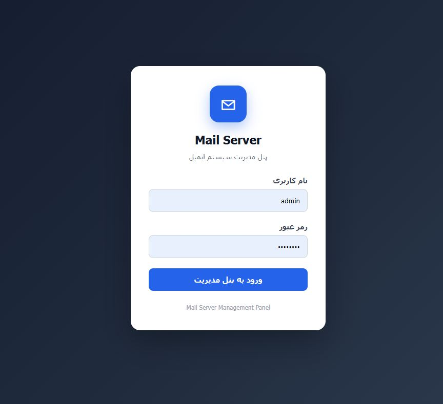
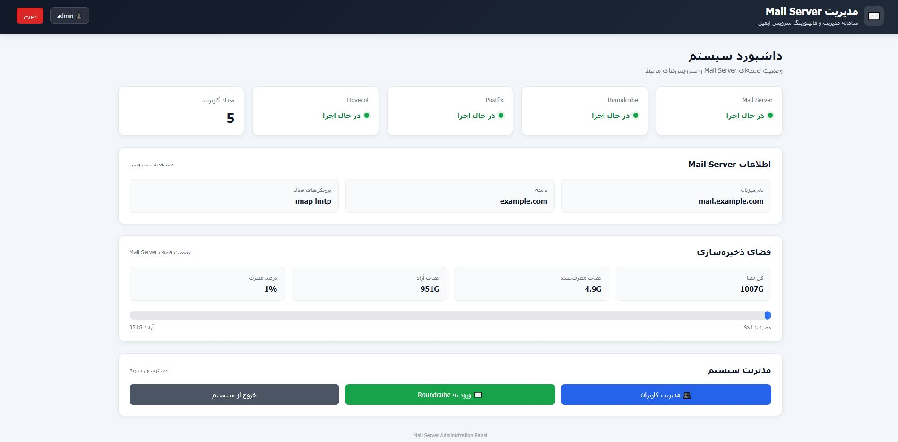
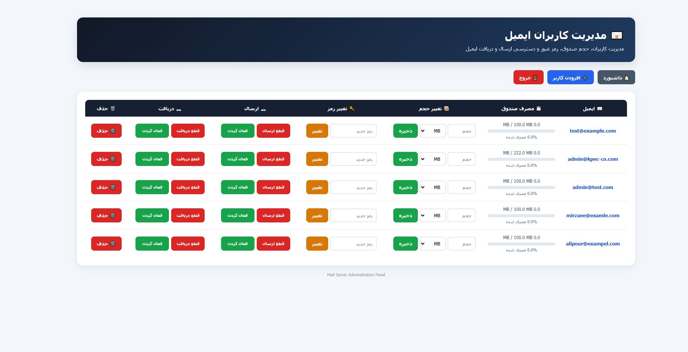
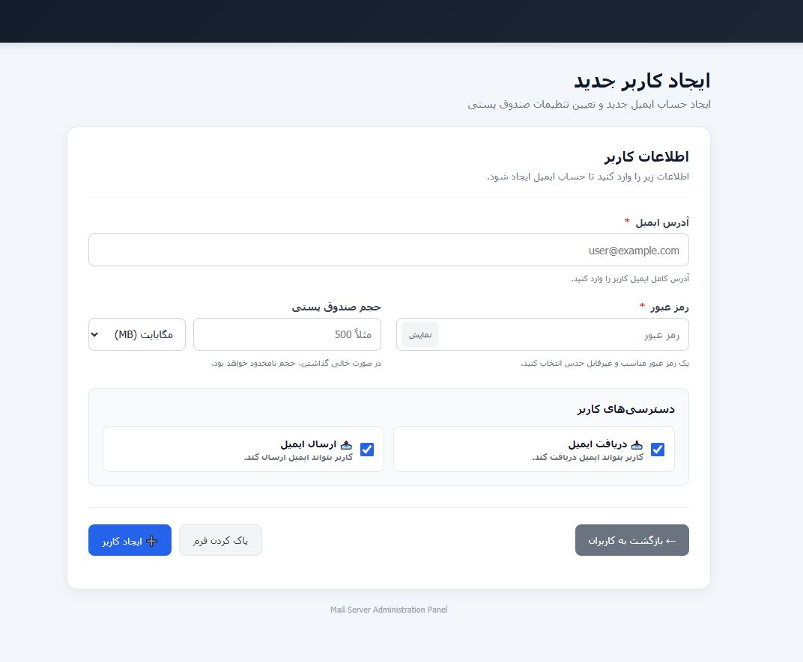
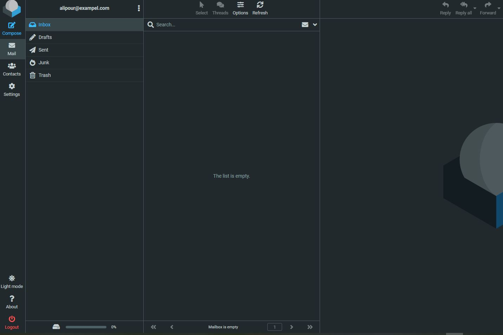

# Docker Mail Server Management System

A self-hosted mail server management system built with **Docker Mail Server, Postfix, Dovecot, Roundcube Webmail, and a custom Flask administration panel**.

The project provides a complete environment for running a containerized mail server and managing mail accounts through a web-based administration interface.

---

## 🚀 Features

* Dockerized mail server
* Postfix SMTP server
* Dovecot IMAP server
* Roundcube Webmail
* Custom Flask administration panel
* Mailbox user management
* Create and delete mail users
* Change mailbox passwords
* Configure mailbox quota
* Enable/disable sending
* Enable/disable receiving
* Mail server status dashboard
* Storage monitoring
* Docker-based deployment
* Persian RTL administration interface
* Screenshots and documentation

---

## 🏗️ Architecture

```text
                    ┌──────────────────────┐
                    │      Web Browser     │
                    └──────────┬───────────┘
                               │
                 ┌─────────────┴─────────────┐
                 │                           │
                 ▼                           ▼
        ┌─────────────────┐        ┌─────────────────┐
        │ Flask Admin     │        │    Roundcube    │
        │ Panel :5000     │        │      :8000      │
        └────────┬────────┘        └────────┬────────┘
                 │                          │
                 └──────────┬───────────────┘
                            │
                            ▼
                  ┌───────────────────┐
                  │   Mail Server     │
                  │                   │
                  │ Postfix           │
                  │ Dovecot           │
                  │ Docker Mailserver │
                  └───────────────────┘
                     │      │      │
                     ▼      ▼      ▼
                    SMTP   IMAP   Mailbox
```

---

## 📦 Main Components

| Component          | Purpose                      |
| ------------------ | ---------------------------- |
| Docker Mail Server | Main mail server environment |
| Postfix            | SMTP mail delivery           |
| Dovecot            | IMAP mailbox access          |
| Roundcube          | Webmail interface            |
| Flask              | Administration panel         |
| Docker Compose     | Container orchestration      |

---

# 🖥️ Requirements

Before installing the project, make sure the following software is installed.

### Required

* Windows 10/11, Linux, or macOS
* Docker Desktop
* Docker Compose
* Python 3.10+
* Git

### Windows

Install Docker Desktop and make sure Docker is running.

Verify Docker:

```powershell
docker --version
```

Verify Docker Compose:

```powershell
docker compose version
```

Verify Python:

```powershell
python --version
```

Verify Git:

```powershell
git --version
```

---

# 📥 Installation

## 1. Clone the Repository

Clone the project:

```bash
git clone https://github.com/YOUR_USERNAME/mailserver.git
```

Enter the project directory:

```bash
cd mailserver
```

---

# ⚙️ 2. Configure Docker Compose

Open:

```text
docker-compose.yml
```

The default configuration uses:

```yaml
hostname: mail
domainname: example.com
```

For a real deployment, replace `example.com` with your own mail domain.

For example:

```yaml
hostname: mail
domainname: example.com
```

could become:

```yaml
hostname: mail
domainname: yourdomain.com
```

The Docker Compose configuration exposes:

| Service         | Port | Purpose                       |
| --------------- | ---: | ----------------------------- |
| SMTP            | 2525 | Mail server SMTP              |
| SMTP Submission |  587 | Authenticated mail submission |
| IMAPS           |  993 | Secure IMAP                   |
| Roundcube       | 8000 | Webmail                       |
| Flask Admin     | 5000 | Administration panel          |

> Port `2525` is mapped to container port `25`. This is useful for local/testing environments where port 25 may already be occupied.

---

# 🐳 3. Start the Mail Server

From the project root:

```bash
docker compose up -d
```

Check running containers:

```bash
docker compose ps
```

You should see:

```text
mailserver
roundcube
```

You can also check all containers:

```bash
docker ps
```

---

# 🔍 4. Check Mail Server Status

Check the mail server hostname:

```bash
docker exec mailserver postconf -h myhostname
```

Check Dovecot protocols:

```bash
docker exec mailserver doveconf -h protocols
```

Check the containers:

```bash
docker ps --format "table {{.Names}}\t{{.Status}}\t{{.Ports}}"
```

Expected services:

```text
mailserver
roundcube
```

---

# 👤 5. Create the First Mailbox

A mailbox must exist before using Roundcube.

Run:

```bash
docker exec -it mailserver setup email add user@example.com StrongPassword
```

Replace:

```text
user@example.com
```

with your desired email address.

Example:

```bash
docker exec -it mailserver setup email add admin@example.com StrongPassword123
```

List existing mailboxes:

```bash
docker exec mailserver setup email list
```

---

# 🌐 6. Open Roundcube

After the containers are running, open:

```text
http://127.0.0.1:8000
```

Login using the mailbox created in the previous step.

Example:

```text
Email:
admin@example.com

Password:
StrongPassword123
```

---

# 🛠️ 7. Install the Flask Administration Panel

Open a new terminal.

Enter the administration panel:

```powershell
cd admin-panel
```

Create a Python virtual environment:

```powershell
python -m venv venv
```

Activate it:

```powershell
.\venv\Scripts\Activate.ps1
```

If PowerShell prevents activation, run:

```powershell
Set-ExecutionPolicy -Scope Process -ExecutionPolicy Bypass
```

Then:

```powershell
.\venv\Scripts\Activate.ps1
```

---

# 📚 8. Install Python Dependencies

Install Flask:

```powershell
pip install flask
```

The administration panel communicates with the Docker Mail Server using Docker commands.

Verify Flask:

```powershell
flask --version
```

---

# 🔐 9. Configure Administration Credentials

The Flask panel supports environment variables for administrator credentials.

### Windows PowerShell

Set the administrator username:

```powershell
$env:ADMIN_USERNAME="admin"
```

Set the administrator password:

```powershell
$env:ADMIN_PASSWORD="ChangeThisPassword"
```

Set the Flask session secret:

```powershell
$env:ADMIN_SECRET_KEY="ChangeThisToA-Random-Secret-Key"
```

For production deployments, use strong unique values.

---

# ▶️ 10. Start the Administration Panel

From:

```text
mailserver/admin-panel
```

run:

```powershell
flask --app app run --host 0.0.0.0 --port 5000
```

The panel will be available at:

```text
http://127.0.0.1:5000
```

From another computer on the same network, use:

```text
http://SERVER-IP:5000
```

For example:

```text
http://192.168.100.7:5000
```

---

# 🔑 11. Login to the Administration Panel

Open:

```text
http://127.0.0.1:5000
```

Login using the administrator credentials configured above.

The dashboard provides information about:

* Mail Server
* Roundcube
* Postfix
* Dovecot
* Mailbox count
* Hostname
* Domain
* Mail protocols
* Storage usage

---

# 👥 12. Mailbox Management

The **Users** page provides mailbox administration.

Available operations include:

### Create User

Create a new mailbox with:

* Email address
* Password
* Quota
* Send permission
* Receive permission

### Change Password

Change the password of an existing mailbox.

### Configure Quota

Configure mailbox storage quota using:

```text
MB
GB
```

### Sending Restrictions

Administrators can:

```text
Disable sending
Enable sending
```

### Receiving Restrictions

Administrators can:

```text
Disable receiving
Enable receiving
```

### Delete User

Delete an existing mailbox.

---

# 📊 Dashboard

The administration dashboard displays the current server state.

Example information:

```text
Mail Server     Running
Roundcube       Running
Postfix         Running
Dovecot         Running
Users           4
```

Storage information includes:

```text
Total Space
Used Space
Available Space
Usage Percentage
```

---

# 🗂️ Project Structure

```text
mailserver/
│
├── admin-panel/
│   │
│   ├── app.py
│   ├── mailserver.py
│   │
│   ├── templates/
│   │   ├── login.html
│   │   ├── dashboard.html
│   │   ├── users.html
│   │   └── add_user.html
│   │
│   └── .gitignore
│
├── docker-compose.yml
├── README.md
├── .gitignore
│
└── screenshots/
    ├── login.JPG
    ├── dash.JPG
    ├── user.JPG
    ├── add-user.JPG
    └── email.JPG
```

---

# 💾 Docker Data

The directory:

```text
docker-data/
```

contains runtime data generated by the mail server.

It may contain:

* Mailbox data
* Mail logs
* Mail server state
* Configuration/runtime data

This directory is intentionally excluded from Git.

A fresh installation creates its own runtime data.

**Do not commit real mailbox data, logs, passwords, or private configuration files to GitHub.**

---

# 🔄 Stopping the Project

Stop the containers:

```bash
docker compose down
```

This stops the containers without intentionally deleting the persistent mail data.

Start them again:

```bash
docker compose up -d
```

---

# 🔁 Restarting a Service

Restart the mail server:

```bash
docker compose restart mailserver
```

Restart Roundcube:

```bash
docker compose restart roundcube
```

Restart both:

```bash
docker compose restart
```

---

# 📋 Viewing Logs

Mail server logs:

```bash
docker logs mailserver
```

Follow live logs:

```bash
docker logs -f mailserver
```

Roundcube logs:

```bash
docker logs roundcube
```

---

# 🧪 Troubleshooting

## Check containers

```bash
docker ps
```

## Check Compose status

```bash
docker compose ps
```

## Check mail server hostname

```bash
docker exec mailserver postconf -h myhostname
```

## Check Dovecot

```bash
docker exec mailserver doveconf -h protocols
```

## List mailboxes

```bash
docker exec mailserver setup email list
```

## Check mail server logs

```bash
docker logs mailserver
```

## Check Roundcube logs

```bash
docker logs roundcube
```

---

# 🔒 Security Notes

This project is designed primarily for self-hosted and development/testing environments.

Before exposing the system to the Internet:

* Use a real domain
* Configure DNS correctly
* Configure MX records
* Configure SPF
* Configure DKIM
* Configure DMARC
* Use valid TLS certificates
* Use strong administrator credentials
* Use strong mailbox passwords
* Protect the Flask administration panel
* Avoid exposing the administration port directly to the Internet
* Use a reverse proxy where appropriate
* Keep Docker images updated
* Back up mailbox data
* Monitor mail server logs

Do not use:

```text
admin123
```

or other default credentials in a production environment.

---

# 🌍 Production DNS

For a real domain such as:

```text
example.com
```

a typical mail configuration would include:

```text
mail.example.com
```

with an appropriate DNS `A` record.

The domain should also have an MX record pointing to the mail server.

Example:

```text
example.com.        MX    10 mail.example.com.
mail.example.com.   A     YOUR.SERVER.IP
```

Additional SPF, DKIM and DMARC configuration is recommended for production mail delivery.

# 📸 Screenshots

The following screenshots demonstrate the main interfaces of the Mail Server Management System.

### 🔐 Login



### 📊 Dashboard



### 👥 User Management



### ➕ Add User



### ✉️ Roundcube Webmail



# 🧰 Technology Stack

```text
Docker
Docker Compose
Docker Mail Server
Postfix
Dovecot
Roundcube
Python
Flask
HTML
CSS
Git
```

---

# 🎯 Project Goals

The goal of this project is to provide a practical self-hosted mail infrastructure combined with a custom administration interface.

The project demonstrates experience with:

* Linux/containerized services
* Docker
* Docker Compose
* SMTP
* IMAP
* Postfix
* Dovecot
* Webmail
* Python
* Flask
* Web application development
* Server administration
* Mailbox management
* Infrastructure automation
* Git-based project management

---

# 📌 Current Status

The project currently provides:

* Docker Mail Server
* Postfix
* Dovecot
* Roundcube
* Flask administration panel
* Mailbox management
* Quota management
* Password management
* Send restrictions
* Receive restrictions
* Server status dashboard
* Storage monitoring
* Documentation
* Screenshots

---

# 📄 License

Add your preferred license here before publishing the project publicly.

For example:

```text
MIT License
```

---

# 👨‍💻 Author

Developed as a self-hosted mail server and infrastructure management project.

Built with:

**Docker + Mail Server + Roundcube + Flask + Python**
